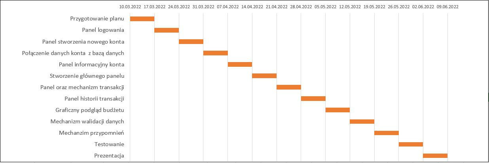

# Personal finance manager

## Przeznaczenie 
Personal finance manager pomoże śledzić Twoje wydatki oraz przychody. Aplikacja ma za zadanie przyczynić się do zwiększenia świadomości na temat stanu finansowego użytkownika. Skutem powinno być polepszenie organizacji zarządzania pieniędzmi.

## Założenia 
- Przeprowadzanie transakcji w ramach budżetu
- Historia transakcji w danym okresie
- Kategoryzacja transakcji (podział wydatków oraz przychodów)
- Podgląd budżetu (podgląd skategoryzowancyh wydatków i przychodów)
- Mechanizm przypomnień

## Technologie
Wybór technologii poparty chęcią zwiększenia wiedzy w kierunku Javy oraz baz danych.

Backend: 
- Java
- Java Database Connectivity / MySQL

Frontend:
- JavaFX, CSS

## Planowany wygląd
Wizualizacja oraz poglądowe zdjęcia aplikacji znajduje się w folderze images. Są to jedynie inspiracje do stworzenia własnej szaty graficznej. 

## Harmonogram

## Status projektu

